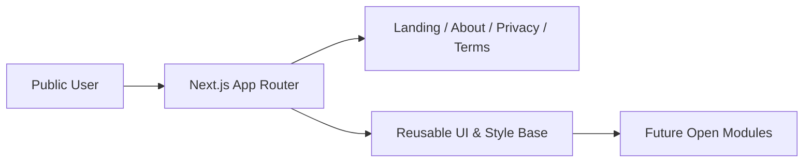

<div align="center">

<br />

# Soulart Open

### Public Open-Source Baseline for an AI Design Product

[](https://github.com/ddlmanus/soulart)
[](https://nextjs.org/)
[](https://nodejs.org/)
[](./LICENSE)
[](./README.md)

</div>

---

## Overview

`Soulart Open` is a **sanitized public edition** extracted from a production AI design system.

This repository is designed for:

- open-source collaboration
- frontend baseline reuse
- independent feature development on top of a clean public starter

It is **not** a full mirror of the private production system.

---

## Features

The open-source edition currently provides:

- App Router project baseline (Next.js)
- Clean landing page structure
- About / Privacy / Terms public pages
- Reusable global style system
- Ready-to-extend project layout for future modules

For the complete private product capability map, see:

- [PROJECT_CORE_FEATURES.md](./PROJECT_CORE_FEATURES.md)

---

## Open-Source Scope

### Included in this public repo

- basic frontend structure
- static public pages
- project bootstrapping and deployment-friendly layout

### Intentionally excluded from this public repo

- full canvas engine implementation
- full chat / agent orchestration module
- full admin backend
- LLM routing and model invocation pipeline
- database schema / migrations / Redis integration
- cloud vendor integrations and production credentials

---

## Architecture (Open Edition)



---

## Project Structure

```text
soulart-open/
├── app/
│   ├── page.tsx
│   ├── about/page.tsx
│   ├── privacy/page.tsx
│   ├── terms/page.tsx
│   ├── layout.tsx
│   └── globals.css
├── public/
├── README.md
├── PROJECT_CORE_FEATURES.md
├── package.json
├── next.config.ts
└── tsconfig.json
```

---

## Quick Start

### 1. Install dependencies

```bash
npm install
```

### 2. Run local development server

```bash
npm run dev
```

### 3. Open in browser

- [http://localhost:3000](http://localhost:3000)

---

## Development Notes

- Keep `.env` local; never commit real secrets.
- Build new features as independent open-source implementations.
- Do not copy private production logic directly into this public repository.

---

## License

This repository is released under the MIT License.
