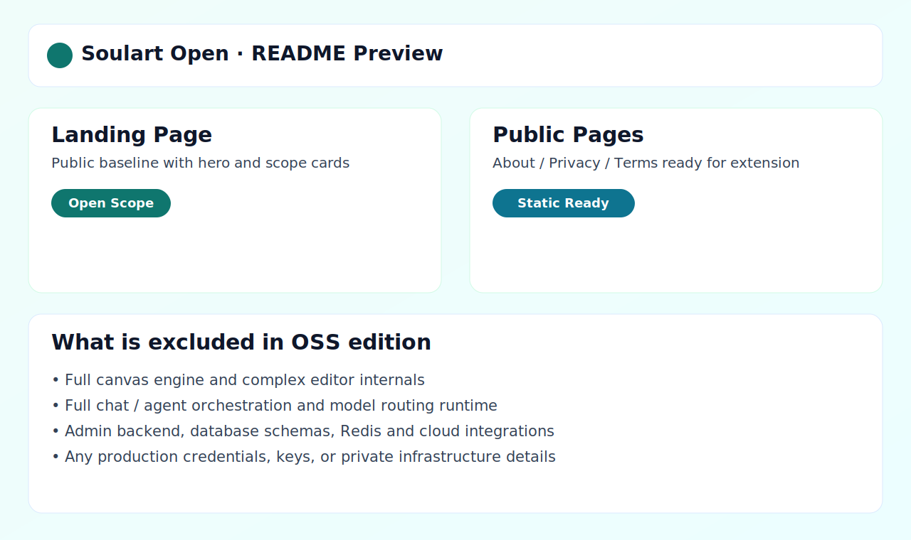
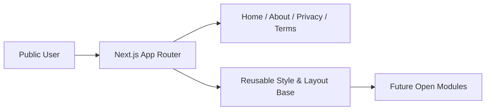

<div align="center">
    # Soulart

#有需要的可以去某鱼上搜Soulart同款Lovart源码

    -----


应用功能部分截图：


</div>

---
应用部分截图：


## Overview

`Soulart ` is a **sanitized public edition** extracted from a production AI design platform.

It is intended as a clean, extensible foundation for:

- open-source collaboration
- frontend baseline reuse
- independent feature development

This repository is intentionally **safe for public release** and does not contain private production internals.

For the full private system capability map (documentation only), see:

- [PROJECT_CORE_FEATURES.md](./PROJECT_CORE_FEATURES.md)

---

## Feature Highlights

| Module | Description |
|---|---|
| `App Router Base` | Next.js App Router scaffold with a minimal, maintainable layout |
| `Public Pages` | Ready pages: Home, About, Privacy, Terms |
| `Style Foundation` | Global CSS tokens and clean visual baseline |
| `Open-Safe Scope` | Sanitized release boundary with clear excluded modules |
| `Extensible Skeleton` | Easy to add future open-source modules on top |

---

## Preview



---

## Open-Source Scope

### Included

- basic frontend project skeleton
- static public pages and route structure
- reusable style and layout foundation
- repo structure suitable for incremental open development

### Excluded (private/product-critical)

- full canvas engine and editor internals
- full chat / agent orchestration
- full admin backend
- LLM routing and provider invocation runtime
- database schemas/migrations, Redis, and cloud service integration
- production credentials and private infrastructure logic

---

## Architecture



---

## Project Structure

```text
soulart-open/
├── app/
│   ├── page.tsx
│   ├── about/page.tsx
│   ├── privacy/page.tsx
│   ├── terms/page.tsx
│   ├── layout.tsx
│   └── globals.css
├── docs/
│   ├── readme-banner.svg
│   └── readme-preview.svg
├── public/
├── PROJECT_CORE_FEATURES.md
├── README.md
├── LICENSE
├── package.json
├── next.config.ts
└── tsconfig.json
```

---

## Quick Start

### 1. Install dependencies

```bash
npm install
```

### 2. Run local dev server

```bash
npm run dev
```

### 3. Open in browser

- [http://localhost:3000](http://localhost:3000)

---

## Roadmap

- [ ] add a reusable component section with docs
- [ ] provide optional API mock layer for frontend demos
- [ ] add tests and CI workflow for open-source quality gate
- [ ] publish contribution templates and issue labels

---

## Contributing

PRs are welcome for open-scope modules.

Before contributing:

- keep changes inside public-safe boundaries
- do not add secrets, private endpoints, or production credentials
- avoid porting private production logic directly

---

## License

Released under the MIT License.
